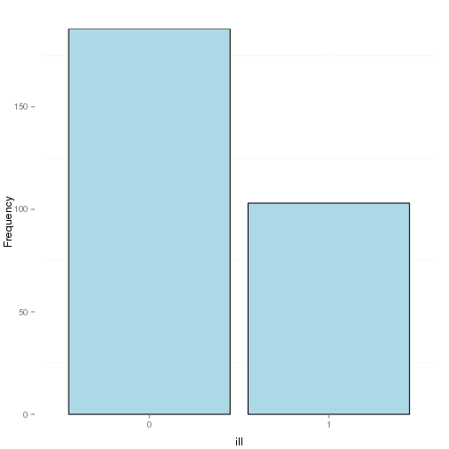
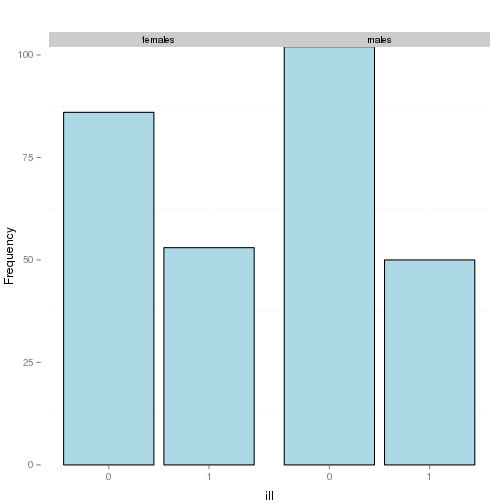

# PACKAGE "EPICONCEPTS"


```r
library(Epiconcepts)
ec.use("Tiramitsu", extension="df");
```

### fonction ec.freq()

SYNTAXE :

  ec.freq(x [, by=y][, where=condition])

EXEMPLE :


```r
ec.freq("ill");
```

<!-- html table generated in R 3.1.2 by xtable 1.7-3 package -->
<!-- Sat Mar  7 22:22:39 2015 -->
<TABLE border=1>
<TR> <TH> ill </TH> <TH> Freq </TH>  </TR>
  <TR> <TD> 0 </TD> <TD align="right"> 188 </TD> </TR>
  <TR> <TD> 1 </TD> <TD align="right"> 103 </TD> </TR>
   </TABLE>

```r
ec.freq("ill", by="sex");
```

<!-- html table generated in R 3.1.2 by xtable 1.7-3 package -->
<!-- Sat Mar  7 22:22:39 2015 -->
<TABLE border=1>
<TR> <TH> ill </TH> <TH> females </TH> <TH> males </TH>  </TR>
  <TR> <TD> 0 </TD> <TD align="right">  86 </TD> <TD align="right"> 102 </TD> </TR>
  <TR> <TD> 1 </TD> <TD align="right">  53 </TD> <TD align="right">  50 </TD> </TR>
   </TABLE>

Il est possible de tracer un histogramme de la fréquence.


```r
res <- ec.freq("ill");
ec.plot(res);
```

 

```r
ec.plot(ec.freq("ill", by="sex"));
```

 

```r
tab = table(GDS$ill, GDS$sex)
print(xtable(tab), type="html")
```

<!-- html table generated in R 3.1.2 by xtable 1.7-3 package -->
<!-- Sat Mar  7 22:22:40 2015 -->
<TABLE border=1>
<TR> <TH>  </TH> <TH> females </TH> <TH> males </TH>  </TR>
  <TR> <TD align="right"> 0 </TD> <TD align="right">  86 </TD> <TD align="right"> 102 </TD> </TR>
  <TR> <TD align="right"> 1 </TD> <TD align="right">  53 </TD> <TD align="right">  50 </TD> </TR>
   </TABLE>

